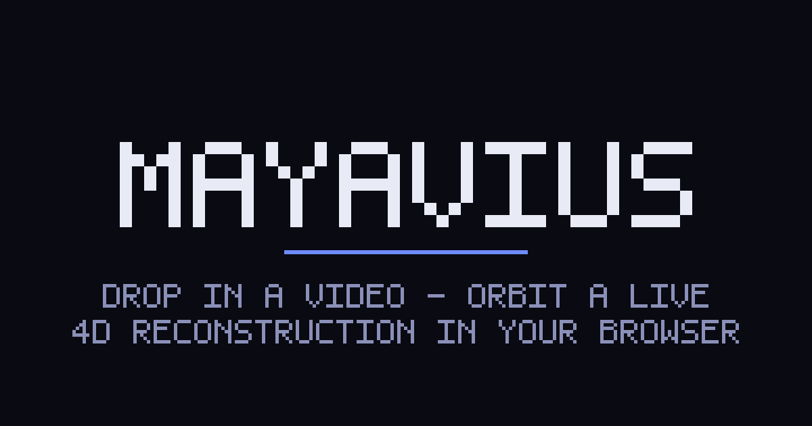

# mayavius

> [!IMPORTANT]  
> This is more of a learning project right now. Please don't be surprised by unusual content in the code and lack of structure. You may find lots of issues. But you can still contribute. I hope you like it.

> **Drop in a short video → orbit, scrub, and bullet-time-freeze an interactive
> 4D point-cloud reconstruction of the scene, right in your browser, shareable
> as a URL.**

Open-source, lightweight, interactive: **no GPU required to *view***, running
the actual frontier 4D research models on your own clip. Upload a few seconds of
casual video; a feedforward backend reconstructs it into a colored 3D point cloud
plus 3D point *tracks*; the browser plays it back: orbit, timeline scrub,
play/pause/loop, and bullet-time freeze-and-orbit. Moving objects animate as dense
point clusters trailing glowing motion ribbons over a stable static background.

**The wow is immediacy and interactivity, not photorealism.**

<!--
  DEMO GIF: the pitch, above the fold.
  Drop a ≤6s looping orbit / scrub / bullet-time clip at assets/demo.gif and
  swap the src below. assets/demo.gif is GENERATED FROM A REAL CORPUS
  RECONSTRUCTION (a bundled CC-licensed sample run through the actual
  VGGT + CoTracker3 pipeline), not a mockup. Until it lands, the branded
  Open Graph card stands in.
-->
<p align="center">
  <!-- TODO(launch): replace with assets/demo.gif (real corpus reconstruction, ≤6s loop) -->
  
</p>

---

## Try it

> **There is no hosted instance.** mayavius runs locally; you clone the repo and
> start it yourself (see [Quickstart](#quickstart)). Everything below runs on your
> own machine at `http://localhost:3000`. A public, GPU-free deployment is possible
> but out of scope here, left to you.

Once it's running locally:

- **Preloaded examples**: the landing page leads with a handful of short
  CC-licensed clips you can open in one click → instant `/view/<slug>` result,
  no upload, no waiting, no GPU.
- **Your own clip**: drop a short video on the landing page → watch it
  reconstruct → get a `/view/<id>` permalink on your local instance.

> Every result is a permalink on your own machine. The viewer is a static client
> that decodes a compact binary blob over HTTP, so a result re-opens with **no GPU
> and no reconstruction**. Sharing a `/view/<id>` link with someone else requires
> them to be running mayavius locally too (the link points at *their* localhost);
> a public host that renders for strangers would be a deployment step you add.

---

## Runs locally on a 36 GB Apple-Silicon Mac (MPS): no cloud, no GPU required to VIEW

The local path is the product's spine and the only path the MVP **requires**.
The viewer is fully client-side; only the *initial reconstruction* uses the GPU
(Apple-Silicon **MPS**, fp32). Sharing or re-opening a result needs neither.

**Measured on-device** (36 GB Apple-Silicon Mac, Python 3.12, torch 2.12 / MPS,
default **VGGT-1B + CoTracker3** combo, a short clip):

| What | Measured |
|------|----------|
| End-to-end reconstruction (upload → done) | **~31 s wall** |
| Peak memory | **~12 GB** |
| Output | static + dense dynamic point clusters + colored track ribbons |
| Wire payload | a compact **MV4D v1** binary the browser plays back **GPU-free** |

> Reconstruction runs on MPS for short clips only (the MVP caps and temporally
> subsamples clip length on purpose; long video is out of scope). A CPU
> fallback works, slower. No cloud GPU is needed for the local path.

---

## Quickstart

Prereqs: Node 20+ (22 LTS recommended), Python **3.12**, macOS 14.0+.

```bash
make setup          # venv (Python 3.12) + lightweight backend deps + npm install (NO PyTorch)

# then, in two terminals:
make dev-backend    # FastAPI → http://localhost:8000  (curl localhost:8000/health → 200)
make dev-frontend   # Next.js  → http://localhost:3000
```

Open **http://localhost:3000**, open a preloaded example, or drop your own clip.
Run `make help` for all targets.

`make setup` installs the **lightweight backend only (no torch)**, so cloning and
first build stay fast and the scaffold runs immediately.

### One-time ML setup (heavy, separate, never committed)

The model weights are multi-GB and **never committed**. Install them once, after
the lightweight path works (full procedure: [spec/08 §4](spec/08-dependencies-and-env.md)):

```bash
cd backend
./.venv/bin/pip install torch torchvision         # Mac wheels = CPU+MPS, no CUDA index
./.venv/bin/pip install -r requirements-ml.txt     # opencv/imageio/hf-hub/einops + VGGT + CoTracker3
export PYTORCH_ENABLE_MPS_FALLBACK=1               # route unimplemented MPS ops to CPU
make dev-backend
```

The first reconstruction triggers a one-time `huggingface-hub` weight pull
(`facebook/VGGT-1B`, `facebook/cotracker3`). The default weights are
non-commercial and **ungated**: no HF login needed for local dev.

---

## How it works

```
short clip  ─►  FastAPI async job  ─►  feedforward reconstruction  ─►  MV4D v1 blob  ─►  browser viewer
            POST /jobs (202 + id)      VGGT-1B (static cloud, depth,        compact          THREE.Points +
            poll / SSE stream           camera) + CoTracker3 (2D tracks      binary            track ribbons,
            GET /jobs/{id}/result       lifted to 3D ribbons), MPS fp32      (no JSON)          GPU-free playback
```

1. **Upload** a short clip → `POST /jobs` returns `202` + a `job_id`.
2. **Reconstruct** asynchronously on MPS: poll `GET /jobs/{id}` or stream
   progress over SSE (`GET /jobs/{id}/stream`); the static cloud paints as soon
   as it arrives, *before* dynamic frames + tracks finish.
3. **Fetch** the result: `GET /jobs/{id}/result` → `application/octet-stream`
   beginning with the bytes `MV4D`, served with an immutable cache header.
4. **View** in the browser: the decoder zero-copies typed arrays straight into
   `THREE.Points` + line ribbons. Orbit, scrub, play/pause/loop, bullet-time.

The render is **Path 1**: colored `THREE.Points` (16-bit positions dequantized
in-shader) plus `Line2`/`LineSegments2` track ribbons over a stable background:
the D4RT aesthetic, GPU-cheap and mobile-capable.

---

## Architecture highlights

- **Hexagonal FastAPI backend.** A pure, model-agnostic core depends only on a
  single port, `ReconstructionPort` (`backend/app/core/ports/reconstruction_port.py`).
  It never imports FastAPI or torch. Models are **driven adapters** behind that
  port (`VggtAdapter`, `CoTracker3Adapter`, and optional `SpatialTrackerV2Adapter`
  / `Pi3Adapter` / `OpenD4RTAdapter`). **Swapping a model never touches the core.**
- **The MV4D v1 compact-binary wire seam: one spec, two implementations.**
  Encoder: `backend/app/wire/encoder.py`. Decoder:
  `frontend/src/lib/wire/decoder.ts`. They stay byte-for-byte compatible
  (`MV4D_VERSION = 1` in both), with a cross-format conformance test. JSON for
  point payloads is forbidden: it is the difference between a ~2 s and a ~40 s
  load, and it gates fast shareable links.
- **Asymmetric compute.** The viewer is cheap and the inference is heavy, and the
  heavy side is isolated behind the async-job + adapter boundary. That split is
  the whole pitch: heavy backend, cheap shareable GPU-free viewer.
- **Designed for a drop-in open D4RT decoder.** The architecture reserves an
  `OpenD4RTAdapter` seam behind `ReconstructionPort` so a future open,
  D4RT-style feedforward 4D decoder ("OpenD4RT") can be wrapped without
  rearchitecting. mayavius does **not** depend on Google DeepMind's (unreleased)
  D4RT; it runs released models today.
- **Path-2 (4D Gaussian Splatting / Spark) seam left inert.** `Scene.tsx` marks a
  documented mount point where a Spark `<SplatMesh>` 4DGS layer could drop in
  alongside Path 1 later. It is **out of MVP** and is not a runtime dependency.

Full map: [spec/04-architecture.md](spec/04-architecture.md) ·
[CLAUDE.md](CLAUDE.md).

---

## License

- **mayavius source code is MIT**, see [LICENSE](LICENSE). Free for any use.
- **Default model weights are non-commercial research weights.** The default
  combo, **VGGT-1B** and **CoTracker3**, ships under **CC-BY-NC-4.0**. This is
  surfaced honestly: the active adapter's `weights_license` is returned by the
  backend's `/health` endpoint and the `/jobs` metadata, and labeled in the
  viewer.
- **No commercial-friendly point tracker exists yet**, so the **motion-ribbon
  (track) feature is research/non-commercial** on any host. A commercial
  deployment can run a **static-only** path via the gated, commercial-licensed
  `facebook/VGGT-1B-Commercial` weights (complete the HF access form, then set
  `MAYAVIUS_VGGT_WEIGHTS`), but it **cannot** ship motion ribbons until a
  permissively-licensed tracker is sourced. We state this plainly; we do not
  hide it.

| Component | License | Commercial? |
|-----------|---------|-------------|
| mayavius source code | **MIT** | yes |
| Frontend deps (Next, React, three, R3F, drei, zustand, Tailwind) | MIT | yes |
| `facebook/VGGT-1B` weights (default static) | CC-BY-NC-4.0 | no (NC) |
| `facebook/cotracker3` weights (default tracker) | CC-BY-NC-4.0 | no (NC) |
| `facebook/VGGT-1B-Commercial` weights (optional, gated) | `vggt-aup-license` (no military) | yes, static-only |

Details: [spec/08 §7](spec/08-dependencies-and-env.md) ·
[spec/03 D2](spec/03-decisions-locked.md).

---

## Testing

The venv lives at `backend/.venv` (Python 3.12). All tests run on the Mac with no
cloud GPU.

| Command | What it proves |
|---------|----------------|
| `make test` | CI set: backend `pytest` (no MPS/GPU) + frontend Vitest + `tsc --noEmit`. Includes the **hexagonal import test** (`app.core.*` imports no FastAPI/torch/adapter) and the **MV4D round-trip / conformance** (encoder ↔ decoder agree byte-for-byte). |
| `make test-e2e` | Playwright drives the viewer against a fixture-mode backend (no GPU): upload flow, orbit/scrub/play/loop/bullet-time controls, and shareable `/view/[id]` share-card metadata. |
| `make test-mps` | Opt-in **on-device MPS smoke** on the 36 GB Mac (needs `requirements-ml.txt`): proves the real VGGT + CoTracker3 combo runs on MPS (fp32) and produces a non-empty `Scene4D` (static cloud + ≥1 dynamic track ribbon). |
| `make lint` | Frontend ESLint (separate target; not part of `make test`). |
| `make typecheck` | `tsc --noEmit`, 0 type errors. |

---

## Project status

**MVP.** The end-to-end product is the spine described above: local-first,
Mac/MPS reconstruction, GPU-free shareable viewer, hexagonal swappable adapters,
honest NC-weight labeling. The source of truth is the numbered specification in
[`spec/`](spec/) (start at [spec/00-index.md](spec/00-index.md)); the acceptance
gate is [spec/13-definition-of-done.md](spec/13-definition-of-done.md).

**Roadmap** (future direction, not MVP scope):

- **Path 2, 4D Gaussian Splatting** via Spark `<SplatMesh>` at the `Scene4D`
  seam in `Scene.tsx`.
- **OpenD4RT adapter**: wrap an open, D4RT-style feedforward 4D decoder behind
  the existing `ReconstructionPort` seam (the path to a *citable* backend).
- **A commercial-friendly tracker** to unblock motion ribbons for commercial
  use.

---

## Layout

```
frontend/   Next.js 16 (App Router) · React 19 · TypeScript · Tailwind v4 · react-three-fiber  (viewer + SEO surfaces)
backend/    Python 3.12 · FastAPI, hexagonal  (core / ports / adapters / jobs / wire / pipeline)
spec/       the numbered specification (source of truth)
assets/     curated CC-licensed sample corpus + (at launch) the demo GIF
```

Per-side details: [frontend/](frontend/) · [backend/README.md](backend/README.md).
