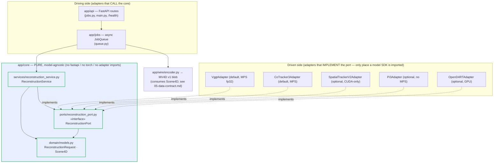

# 04 — Architecture

How mayavius is wired: a Next.js 16 / react-three-fiber frontend, a FastAPI
**hexagonal** backend, and the **`MV4D` v1** binary wire-format seam between them.
This file documents the **actual** on-disk structure (the scaffold under
`backend/app/**` and `frontend/src/**`); the build fills in stubs, it does **not**
rearchitect. Locked decisions: [03-decisions-locked.md](03-decisions-locked.md).
The wire format is owned by [05-data-contract.md](05-data-contract.md); backend
internals by [06-backend-spec.md](06-backend-spec.md); frontend internals by
[07-frontend-spec.md](07-frontend-spec.md); the architecture-enforcing test by
[10-testing-strategy.md](10-testing-strategy.md).

---

## 1. Component overview

Three components, two boundaries, one direction of compute asymmetry.

| Component | Tech | Role | Compute |
|-----------|------|------|---------|
| **Frontend** | Next.js 16 App Router · React 19.2 · react-three-fiber 9.6 · Three 0.184 · Zustand 5 | Static landing (SEO) + shareable result route + the client-only WebGL viewer (Path 1) | **Cheap** — runs fully local, GPU-free to *view* |
| **Backend** | FastAPI 0.136 · Python 3.12 · hexagonal core + model adapters + async job queue | Decode clip → run feedforward model(s) → build `Scene4D` → encode `MV4D` blob | **Heavy** — MPS (fp32) inference, isolated behind the async-job + adapter boundary |
| **Wire seam** | `MV4D` v1 compact binary | The single byte-for-byte contract between encoder and decoder | — |

The two boundaries that must never blur:

1. **The hexagonal boundary (backend-internal):** `app/core` is pure and
   model-agnostic; it depends ONLY on `ReconstructionPort`. Models, FastAPI and
   the job queue live *outside* the core. See §4.
2. **The wire seam (cross-process):** the backend `encode_reconstruction` and the
   frontend `decodeReconstruction` are two implementations of ONE format. JSON for
   point payloads is forbidden (D7 — wire format; handover §4 #5). The authority is
   [05-data-contract.md](05-data-contract.md) — never redefine its bytes here.

The asymmetry is the whole point: a casual upload triggers seconds of heavy MPS
inference once, producing a ≤12 MB immutable blob; every subsequent view is a
cheap, cacheable, GPU-free WebGL replay (orbit, scrub, loop, bullet-time).

---

## 2. Hexagonal dependency graph (arrows point INWARD to the core)

The core knows nothing about who drives it (API, jobs) or what fulfills it
(adapters). Every dependency arrow points **toward** `app/core`; nothing inside
the core points out.



Reading the graph:
- **Driving side** (`api`, `jobs`) depends on the core's `ReconstructionService`.
  The API never touches an adapter directly; it goes through the service.
- **Driven side** (adapters) depend on `ReconstructionPort` + `domain` and nothing
  else in the app. The adapter is *injected* into the service
  (`ReconstructionService(adapter)`).
- **`app/wire/encoder.py`** consumes the core's `Scene4D` and produces the `MV4D`
  blob. It is invoked on the driving side (the job worker), keeping the core free
  of serialization concerns. The encoder imports `numpy` only — never torch.
- The default combo (D1) is **`VggtAdapter` + `CoTracker3Adapter`**: VGGT gives the
  static colored cloud + depth + camera; CoTracker3 gives 2D tracks lifted to 3D
  via VGGT depth. The other three adapters are optional/cloud (see §4, [08](08-dependencies-and-env.md)).

---

## 3. End-to-end sequence (upload → job id → progress → fetch → decode → render)

Static cloud renders **first** (it is sent once and drawn every frame), then
dynamic frames + track ribbons fill in — the "progressive cloud, not a spinner"
behavior (handover §4 #4 — async job model / stream frames). Progress is delivered by **FastAPI built-in SSE** (`fastapi.sse`,
**not** `sse-starlette`; C7); the same status is also pollable via `GET /jobs/{id}`.

```mermaid
sequenceDiagram
  autonumber
  participant U as Browser (ViewerClient + viewerStore)
  participant API as app/api (FastAPI routes)
  participant Q as app/jobs (JobQueue + worker)
  participant SVC as app/core ReconstructionService
  participant AD as Adapter (Vggt + CoTracker3, MPS fp32)
  participant ENC as app/wire encoder (MV4D v1)

  U->>API: POST /jobs (multipart UploadFile: short clip)
  API->>Q: submit(clip) → job id
  API-->>U: 202 Accepted { job id }
  Q->>SVC: run(ReconstructionRequest) [off-thread worker]
  SVC->>AD: reconstruct(request)
  Note over AD: decode + subsample video → frames<br/>VGGT static cloud/depth/camera<br/>CoTracker3 2D tracks → lift to 3D
  AD-->>SVC: Scene4D (numpy; no torch crosses the boundary)
  SVC->>ENC: encode_reconstruction(Scene4D)
  ENC-->>Q: MV4D v1 bytes (≤12 MB target)

  par Progress (SSE stream; pollable fallback)
    U->>API: GET /jobs/{id} (SSE subscribe / poll)
    API->>Q: status()
    Q-->>API: { status, progress 0..1 }
    API-->>U: events: queued → running(0..1) → done
  end

  U->>API: GET /jobs/{id}/result
  API->>Q: result()
  Q-->>API: MV4D blob (brotli/gzip at route level; immutable cache header)
  API-->>U: 200 application/octet-stream
  U->>U: decodeReconstruction(ArrayBuffer) → Mv4dScene (zero-copy views)
  Note over U: Render STATIC_POINTS first (THREE.Points + shader)
  U->>U: then DYNAMIC_FRAMES + TRACKS ribbons; CAMERAS drive as-shot view
  Note over U: viewerStore: time 0..1 · isPlaying · loop · frozen (bullet-time)
```

Notes that bind to other specs:
- The `Scene4D` shape and `encode_reconstruction(scene) -> bytes` signature are
  defined in [05-data-contract.md](05-data-contract.md) §5.1; the route contract
  (`POST /jobs`, `GET /jobs/{id}`, `GET /jobs/{id}/result`, `GET /health`) and the
  SSE event schema in [06-backend-spec.md](06-backend-spec.md).
- SSE is **incompatible with `GZipMiddleware`** — the *result* blob is compressed
  at the route level, the SSE stream is not ([08](08-dependencies-and-env.md) §3).
- `decodeReconstruction(buffer) -> Mv4dScene` and the render attribute mapping are
  in [07-frontend-spec.md](07-frontend-spec.md); error contract in
  [05-data-contract.md](05-data-contract.md) §8.

---

