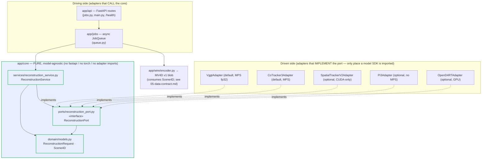
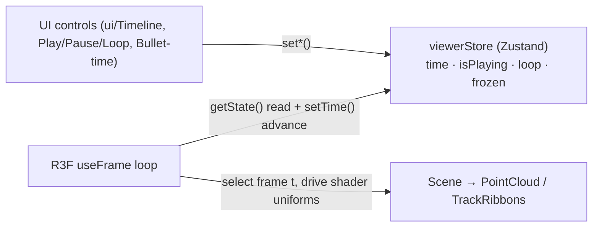

# 04 — Architecture

How mayavius is wired: a Next.js 16 / react-three-fiber frontend, a FastAPI
**hexagonal** backend, and the **`MV4D` v1** binary wire-format seam between them.
This file documents the **actual** on-disk structure (the scaffold under
`backend/app/**` and `frontend/src/**`); the build fills in stubs, it does **not**
rearchitect. Locked decisions: [03-decisions-locked.md](03-decisions-locked.md).
The wire format is owned by [05-data-contract.md](05-data-contract.md); backend
internals by [06-backend-spec.md](06-backend-spec.md); frontend internals by
[07-frontend-spec.md](07-frontend-spec.md); the architecture-enforcing test by
[10-testing-strategy.md](10-testing-strategy.md).

---

## 1. Component overview

Three components, two boundaries, one direction of compute asymmetry.

| Component | Tech | Role | Compute |
|-----------|------|------|---------|
| **Frontend** | Next.js 16 App Router · React 19.2 · react-three-fiber 9.6 · Three 0.184 · Zustand 5 | Static landing (SEO) + shareable result route + the client-only WebGL viewer (Path 1) | **Cheap** — runs fully local, GPU-free to *view* |
| **Backend** | FastAPI 0.136 · Python 3.12 · hexagonal core + model adapters + async job queue | Decode clip → run feedforward model(s) → build `Scene4D` → encode `MV4D` blob | **Heavy** — MPS (fp32) inference, isolated behind the async-job + adapter boundary |
| **Wire seam** | `MV4D` v1 compact binary | The single byte-for-byte contract between encoder and decoder | — |

The two boundaries that must never blur:

1. **The hexagonal boundary (backend-internal):** `app/core` is pure and
   model-agnostic; it depends ONLY on `ReconstructionPort`. Models, FastAPI and
   the job queue live *outside* the core. See §4.
2. **The wire seam (cross-process):** the backend `encode_reconstruction` and the
   frontend `decodeReconstruction` are two implementations of ONE format. JSON for
   point payloads is forbidden (D7 — wire format; handover §4 #5). The authority is
   [05-data-contract.md](05-data-contract.md) — never redefine its bytes here.

The asymmetry is the whole point: a casual upload triggers seconds of heavy MPS
inference once, producing a ≤12 MB immutable blob; every subsequent view is a
cheap, cacheable, GPU-free WebGL replay (orbit, scrub, loop, bullet-time).

---

## 2. Hexagonal dependency graph (arrows point INWARD to the core)

The core knows nothing about who drives it (API, jobs) or what fulfills it
(adapters). Every dependency arrow points **toward** `app/core`; nothing inside
the core points out.



Reading the graph:
- **Driving side** (`api`, `jobs`) depends on the core's `ReconstructionService`.
  The API never touches an adapter directly; it goes through the service.
- **Driven side** (adapters) depend on `ReconstructionPort` + `domain` and nothing
  else in the app. The adapter is *injected* into the service
  (`ReconstructionService(adapter)`).
- **`app/wire/encoder.py`** consumes the core's `Scene4D` and produces the `MV4D`
  blob. It is invoked on the driving side (the job worker), keeping the core free
  of serialization concerns. The encoder imports `numpy` only — never torch.
- The default combo (D1) is **`VggtAdapter` + `CoTracker3Adapter`**: VGGT gives the
  static colored cloud + depth + camera; CoTracker3 gives 2D tracks lifted to 3D
  via VGGT depth. The other three adapters are optional/cloud (see §4, [08](08-dependencies-and-env.md)).

---

## 3. End-to-end sequence (upload → job id → progress → fetch → decode → render)

Static cloud renders **first** (it is sent once and drawn every frame), then
dynamic frames + track ribbons fill in — the "progressive cloud, not a spinner"
behavior (handover §4 #4 — async job model / stream frames). Progress is delivered by **FastAPI built-in SSE** (`fastapi.sse`,
**not** `sse-starlette`; C7); the same status is also pollable via `GET /jobs/{id}`.

```mermaid
sequenceDiagram
  autonumber
  participant U as Browser (ViewerClient + viewerStore)
  participant API as app/api (FastAPI routes)
  participant Q as app/jobs (JobQueue + worker)
  participant SVC as app/core ReconstructionService
  participant AD as Adapter (Vggt + CoTracker3, MPS fp32)
  participant ENC as app/wire encoder (MV4D v1)

  U->>API: POST /jobs (multipart UploadFile: short clip)
  API->>Q: submit(clip) → job id
  API-->>U: 202 Accepted { job id }
  Q->>SVC: run(ReconstructionRequest) [off-thread worker]
  SVC->>AD: reconstruct(request)
  Note over AD: decode + subsample video → frames<br/>VGGT static cloud/depth/camera<br/>CoTracker3 2D tracks → lift to 3D
  AD-->>SVC: Scene4D (numpy; no torch crosses the boundary)
  SVC->>ENC: encode_reconstruction(Scene4D)
  ENC-->>Q: MV4D v1 bytes (≤12 MB target)

  par Progress (SSE stream; pollable fallback)
    U->>API: GET /jobs/{id} (SSE subscribe / poll)
    API->>Q: status()
    Q-->>API: { status, progress 0..1 }
    API-->>U: events: queued → running(0..1) → done
  end

  U->>API: GET /jobs/{id}/result
  API->>Q: result()
  Q-->>API: MV4D blob (brotli/gzip at route level; immutable cache header)
  API-->>U: 200 application/octet-stream
  U->>U: decodeReconstruction(ArrayBuffer) → Mv4dScene (zero-copy views)
  Note over U: Render STATIC_POINTS first (THREE.Points + shader)
  U->>U: then DYNAMIC_FRAMES + TRACKS ribbons; CAMERAS drive as-shot view
  Note over U: viewerStore: time 0..1 · isPlaying · loop · frozen (bullet-time)
```

Notes that bind to other specs:
- The `Scene4D` shape and `encode_reconstruction(scene) -> bytes` signature are
  defined in [05-data-contract.md](05-data-contract.md) §5.1; the route contract
  (`POST /jobs`, `GET /jobs/{id}`, `GET /jobs/{id}/result`, `GET /health`) and the
  SSE event schema in [06-backend-spec.md](06-backend-spec.md).
- SSE is **incompatible with `GZipMiddleware`** — the *result* blob is compressed
  at the route level, the SSE stream is not ([08](08-dependencies-and-env.md) §3).
- `decodeReconstruction(buffer) -> Mv4dScene` and the render attribute mapping are
  in [07-frontend-spec.md](07-frontend-spec.md); error contract in
  [05-data-contract.md](05-data-contract.md) §8.

---

## 4. The hexagonal mandate (import rules — make wrong architecture hard to write)

**`app/core` is a pure, model-agnostic core.** It depends ONLY on
`app/core/ports/reconstruction_port.py:ReconstructionPort` and the dataclasses in
`app/core/domain/models.py`. It MUST NEVER import FastAPI, torch, numpy-as-a-model-
dependency-surface (the encoder may use numpy; the *core* stays free of it where
practical), or any concrete adapter. Swapping models must not touch the core.

| Layer | Path | May import | MUST NOT import |
|-------|------|-----------|-----------------|
| **Core (pure)** | `app/core/{domain,ports,services}` | stdlib, the port, the domain dataclasses | `fastapi`, `torch`, `app.adapters.*`, `app.api.*`, `app.jobs.*` |
| **Driven adapters** | `app/adapters/*_adapter.py` | its own model SDK (`vggt`, `cotracker`, …), `torch`, the port, the domain | `fastapi`, `app.api.*`, `app.jobs.*`, *another* adapter |
| **Driving — API** | `app/api/**`, `app/main.py` | `fastapi`, the service, the job queue | a concrete model SDK directly (`torch`, `vggt`) |
| **Driving — jobs** | `app/jobs/**` | the service, the encoder, the chosen adapter (for wiring/injection) | `fastapi` request/response types in core logic |
| **Wire** | `app/wire/encoder.py` | `numpy`, the domain `Scene4D` | `torch`, `fastapi`, `app.adapters.*` |

Why it is shaped this way:
- A model/SDK is imported in **exactly one place** — its adapter. This is what lets
  the default MPS combo (VGGT + CoTracker3) coexist with CUDA-only / no-MPS
  adapters (SpatialTrackerV2, Pi3) and the GPU `OpenD4RTAdapter` without the core
  ever learning a device or a tensor type exists.
- The adapter boundary is also the **license boundary**: each adapter
  license-tags its model (`weights_license`, surfaced via job metadata — D2,
  [06](06-backend-spec.md)). NC defaults are labeled, not hidden.

**Enforcement is a test, not a convention.** [10-testing-strategy.md](10-testing-strategy.md)
defines an import-discipline test that statically asserts no module under
`app/core/**` imports `fastapi`, `torch`, or `app.adapters.*`. Architecture drift
fails CI. Negative knowledge stays first-class: π³ has no official MPS path,
SpatialTrackerV2 is CUDA-only, fp16-on-MPS is *available but unused by choice*
(C3), and MegaSaM is optimization-based (rejected for the interactive MVP on
performance) — documented in [08](08-dependencies-and-env.md) and the
[decision log](decisions/decision-log.md), not rediscovered.

---

## 5. Canonical repository structure

The monorepo as it exists today, annotated with the files the **build adds**
(marked `+`). The build fills stubs and adds leaf modules; it does **not** move or
rename the existing tree.

```
mayavius/
├── CLAUDE.md · SPEC_BUILD_HANDOVER.md · Makefile · README.md
├── spec/                              # this spec set (03,04,05,06,07,08,10,11 …)
│   └── decisions/decision-log.md
│
├── backend/
│   ├── requirements.txt · requirements-dev.txt · requirements-ml.txt
│   ├── pyproject.toml · README.md
│   ├── tests/                         # + pytest suites (spec/10): import-discipline,
│   │                                  #   MV4D round-trip, /health + 501 smoke, caps
│   └── app/
│       ├── main.py                    # FastAPI app, CORS, router include, /health
│       ├── config.py                  # MAYAVIUS_-prefixed settings (+ adapter, device)
│       ├── api/routes/jobs.py         # POST /jobs · GET /jobs/{id} (+SSE) · /result
│       ├── jobs/queue.py              # + JobQueue.submit()/status()/result() + worker
│       ├── core/
│       │   ├── domain/models.py       # ReconstructionRequest (+) Scene4D/Tracks/CameraTrack
│       │   ├── ports/reconstruction_port.py   # ReconstructionPort (+ final method set)
│       │   └── services/reconstruction_service.py  # ReconstructionService (caps, split)
│       ├── adapters/
│       │   ├── vggt_adapter.py            # default static cloud + depth + camera (MPS fp32)
│       │   ├── cotracker3_adapter.py      # default 2D tracks → lifted 3D (MPS)
│       │   ├── spatialtracker_adapter.py  # optional, CUDA-only (cloud)
│       │   ├── pi3_adapter.py             # optional, no MPS
│       │   └── open_d4rt_adapter.py       # optional, GPU
│       ├── wire/encoder.py            # MV4D v1 encoder (Scene4D → bytes)
│       └── + pipeline/                # + build adds: video decode/subsample, 2D→3D
│                                      #   lift, static/dynamic split, AABB+quantize helpers
│
├── frontend/
│   ├── package.json · AGENTS.md (read first — Next 16 differs)
│   ├── public/                        # + og.png, sample thumbnails, favicons
│   └── src/
│       ├── config.ts                  # SITE_NAME, API_BASE_URL (NEXT_PUBLIC_*)
│       ├── app/
│       │   ├── layout.tsx · page.tsx  # static, indexable landing (Server Component)
│       │   ├── view/[id]/page.tsx     # shareable result route (async params + generateMetadata)
│       │   ├── sitemap.ts · robots.ts # SEO surfaces
│       │   └── + view/[id]/opengraph-image.tsx  # + per-result OG/twitter (next/og; spec/07 §8)
│       ├── components/viewer/
│       │   ├── ViewerClient.tsx       # 'use client' — dynamic(import ViewerCanvas,{ssr:false})
│       │   ├── ViewerCanvas.tsx       # <Canvas> host + OrbitControls
│       │   ├── Scene.tsx              # Scene4D root + Path-1/Path-2 seam (§6)
│       │   ├── + PointCloud.tsx       # + THREE.Points + custom shader (dequant in GPU)
│       │   ├── + TrackRibbons.tsx     # + Line2/LineSegments2 ribbons (visibility-aware)
│       │   └── + ui/                  # + Timeline scrubber, Play/Pause/Loop, Bullet-time
│       ├── lib/
│       │   ├── state/viewerStore.ts   # Zustand: time/isPlaying/loop/frozen
│       │   ├── api/client.ts          # submitClip / getJobStatus / fetchResult
│       │   └── wire/decoder.ts        # MV4D v1 decoder (zero-copy views)
│       └── types/index.ts             # JobHandle (+) Mv4dScene (replaces ReconstructionResult)
```

Files the build **adds** but that are not yet present: backend `app/pipeline/*`
(decode/subsample, lift, split, quantize helpers — kept out of the adapters so the
adapter stays thin), backend `tests/*`; frontend `PointCloud.tsx`,
`TrackRibbons.tsx`, the `ui/` controls, `app/view/[id]/opengraph-image.tsx`
(+`twitter-image.tsx`; per-result share image via `next/og`, owned by
[07-frontend-spec.md](07-frontend-spec.md) §8), and `public/` assets. The placeholder `ReconstructionResult` (TS) and the placeholder
`ReconstructionResult` dataclass (Python) are **replaced** by `Mv4dScene` and
`Scene4D` respectively per [05-data-contract.md](05-data-contract.md) §5 — update
decoder.ts, client.ts, types/index.ts and the backend domain/encoder **together**.

---

## 6. The Path-1 / Path-2 render seam (`Scene.tsx`)

`frontend/src/components/viewer/Scene.tsx` is the seam. Today it renders a
placeholder icosahedron proving the R3F pipeline works end to end. The build
replaces that body with the **Path 1** layers; the **Path 2** layer is designed
for but NOT built (handover §4 #2 — 4DGS out of MVP; [03](03-decisions-locked.md) Part 1 §2).

| | Path 1 (LOCKED — MVP) | Path 2 (OUT of MVP — design only) |
|---|----------------------|-----------------------------------|
| Render | `THREE.Points` + custom shader (positions dequantized on the GPU) + `Line2`/`LineSegments2` track ribbons | Spark `@sparkjsdev/spark` `<SplatMesh>` (4DGS) |
| Components | `<PointCloud>` + `<TrackRibbons>` | a `<SplatLayer>` mounted *alongside* Path 1 |
| Deps | ships inside `three` (`three/addons/lines/…`) — no new runtime dep | `@sparkjsdev/spark` (MIT) — **do not add** for MVP |
| Why deferred | — | needs per-scene optimization (GPU-heavy, not feedforward) |

```
<Scene>                       // reads decoded Mv4dScene + viewerStore
 ├─ <PointCloud static />     // STATIC_POINTS — drawn first, every frame
 ├─ <PointCloud dynamic />    // DYNAMIC_FRAMES[t] — current timestep
 ├─ <TrackRibbons />          // TRACKS — visibility-gated polylines
 └─ // SEAM: <SplatLayer />   // Path 2 mounts here later; no rearchitecting
```

The mandate: keep controls and the timeline **decoupled** from the render path so
a 4DGS layer can mount at this seam without touching `ViewerCanvas`, the controls,
or `viewerStore`. Camera/orbit/bullet-time read the same store regardless of which
render path is active. Render-attribute details: [07-frontend-spec.md](07-frontend-spec.md).

---

## 7. State flow (Zustand `viewerStore`; R3F loop reads/writes outside React)

State lives in `frontend/src/lib/state/viewerStore.ts` (D6). It holds the playback
transients (`time`/`isPlaying`/`loop`/`frozen`/`cameraMode`) **and** the decoded
`scene: Mv4dScene | null`, set once by `setScene` on load ([07 §4](07-frontend-spec.md)
owns the store shape). The R3F loop reads `scene` via `getState()` **without
subscribing** (no per-frame re-render); render layers read it from the store, not via
props. (The high-frequency field is `time`; `scene` is written once, so keeping it in
the store costs nothing and avoids prop-threading through the Path-1/Path-2 seam.)

| Field | Type | Meaning |
|-------|------|---------|
| `time` | `number` 0..1 | normalized playback position → frame `t = round(time*(T−1))` ([05](05-data-contract.md) §2) |
| `isPlaying` | `boolean` | play/pause |
| `loop` | `boolean` | wrap at end (default `true`) |
| `frozen` | `boolean` | **bullet-time** — freeze playback, free-orbit the frozen frame |



The discipline (D6, scaffold rationale): the **R3F `useFrame` loop reads and
writes the store via `getState()` / `setState()` outside React's render cycle** —
no React re-render per animation frame. When `isPlaying` and not `frozen`, the loop
advances `time` (wrapping if `loop`), maps it to frame `t`, and updates shader
uniforms / ribbon visibility. UI controls mutate the store through its actions;
high-frequency scrubber drags stay cheap because they do not re-render the tree.
Full hook wiring: [07-frontend-spec.md](07-frontend-spec.md).
