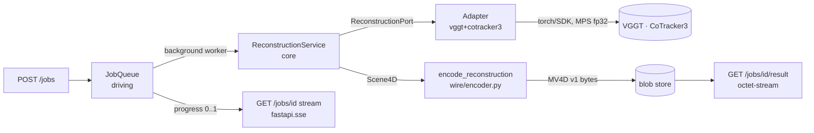

# 06 — Backend Spec

How the build **fills in** the existing `backend/app/**` stubs. This spec does
**not** rearchitect the tree — it finalizes signatures, the port contract, the
adapters, the reconstruction pipeline, the async job model, and the exact FastAPI
surface. The hexagonal boundary (handover §3) is **non-negotiable**.

Authority chain:
- The **MV4D v1 wire bytes** are owned by [05-data-contract.md](05-data-contract.md) — referenced here, **never** redefined.
- The **`Scene4D` domain model** is owned by [05-data-contract.md](05-data-contract.md) §5.1 — reproduced below for convenience; if they disagree, **05 wins**.
- **Versions / repo IDs / licenses / MPS install** are owned by [08-dependencies-and-env.md](08-dependencies-and-env.md) — never invent a version here.
- **Locked decisions** D1–D10 + corrections C1–C7 are owned by [03-decisions-locked.md](03-decisions-locked.md).
- Frontend consumption (decoder, render attrs) is [07-frontend-spec.md](07-frontend-spec.md); tests are spec/10; deploy is spec/11.

---

## 1. Layering map (what is core, what is not)

Files marked `(new)` are created by the build; the rest fill existing stubs.

```
backend/app/
  core/                      ← PURE. No fastapi, no torch, no adapter imports.
    ports/reconstruction_port.py   ReconstructionPort + AdapterInfo + ProgressSink
    domain/models.py               ReconstructionRequest, Scene4D + sub-models
    domain/errors.py        (new)   ReconstructionError hierarchy (§2.2)
    services/reconstruction_service.py  ReconstructionService + smooth/cull/caps helpers (pure numpy; NOT split)
  adapters/                  ← DRIVEN. The ONLY place a model SDK / torch is imported.
    vggt_adapter.py · cotracker3_adapter.py · spatialtracker_adapter.py
    pi3_adapter.py · open_d4rt_adapter.py        (fill stubs)
    combo.py          (new)  VggtCoTracker3Adapter — default "vggt+cotracker3" (§4.6)
    registry.py       (new)  id → factory; build_adapter() (§4.6)
    fixture_adapter.py (new) FixtureAdapter — "fake" no-ML fixture mode (§4.6)
  pipeline/           (new)  ← shared, model-agnostic-ish utils (numpy/opencv; no fastapi)
    decode.py                decode_and_subsample(request) → frames [S,3,H,W] @ width 518
    lift.py                  2D tracks + VGGT depth/intrinsics/pose → 3D Tracks (§5 step 4 formula)
    assemble.py              assemble_scene4d(geo, tr, request) → already-split Scene4D (DOES the static/dynamic split using geo's raw per-frame maps; §4.6/§5)
    quantize.py              AABB + 16-bit quantize helpers (for the encoder)
  wire/encoder.py            encode_reconstruction(scene: Scene4D) -> bytes  (MV4D v1)
  wire/decoder.py     (new)  Python reference decoder — `decode(buffer: bytes) -> Scene4D` (mirrors spec/05 §3): dequantized f32 positions, dynamic_positions as list[ndarray] per frameDir, visibility (M,T) bool unpacked from the LSB-first bitmask, static_conf/colors u8. Used by tests (T-100) + FixtureAdapter.
  jobs/queue.py              JobQueue + in-process background worker  ← DRIVING
  api/routes/jobs.py         FastAPI endpoints                        ← DRIVING
  api/sse.py / api/errors.py / api/deps.py  (new)  SSE helper, error→HTTP map, DI wiring  ← DRIVING
  main.py · config.py        (fill: lifespan adapter wiring; new Settings fields §8)
```
Shared helpers named in §4/§5 (`decode_and_subsample`, the 2D→3D lift,
`assemble_scene4d`/quantize) live in `app/pipeline/*` — kept out of the adapters so
each adapter stays thin. The **model-agnostic** post-processing (`smooth_and_cull`,
`enforce_caps`) lives in `core/services/` (numpy, no torch); the **static/dynamic
split** lives in `pipeline/assemble.py` (adapter-side) because it consumes the raw
per-frame VGGT maps in `GeometryResult`, which never enter `Scene4D` / cross the port.

**The one rule that makes wrong architecture hard to write:** `core/` imports
nothing from `adapters/`, `api/`, `jobs/`, `wire/`, FastAPI, numpy-via-torch, or
torch. It imports `numpy` only (domain arrays). A lint/import test in spec/10
asserts this. Adapters return **numpy / Python types only** — no torch tensor
crosses the port boundary.



---

## 2. `ReconstructionPort` — full contract

Replaces the scaffold in `core/ports/reconstruction_port.py`. The stub had a
single `reconstruct(request) -> ReconstructionResult`; the finalized port adds a
**progress sink**, a **capabilities/`info()`** descriptor, and a **typed error
hierarchy**.

```python
# core/ports/reconstruction_port.py
from __future__ import annotations
from abc import ABC, abstractmethod
from dataclasses import dataclass
from typing import Protocol

from app.core.domain.models import ReconstructionRequest, Scene4D


class ProgressSink(Protocol):
    """Adapters report fractional progress; the worker forwards it to /jobs/{id}.
    Pure callable — no FastAPI/queue type leaks into core."""
    def __call__(self, progress: float, stage: str) -> None: ...
    # progress in [0,1]; stage is a short label e.g. "vggt", "tracking", "encode".


@dataclass(frozen=True)
class AdapterInfo:
    """Static capability + provenance descriptor. Surfaced in job metadata so the
    API can label the active model's weight license (D2) and gate by capability."""
    name: str                 # stable id, e.g. "vggt+cotracker3"
    produces_tracks: bool     # emits Tracks (the ribbons)?
    dynamic: bool             # emits per-frame dynamic foreground points?
    mps_capable: bool         # runs on the 36GB Apple-Silicon Mac via MPS (fp32)?
    weights_license: str      # SPDX-ish tag, e.g. "cc-by-nc-4.0" (D2 / spec/08 §7)
    default_weights: str      # HF repo id, e.g. "facebook/VGGT-1B"


class ReconstructionPort(ABC):
    """Implemented by every model adapter (app/adapters/*)."""

    name: str  # short, stable id; mirrors AdapterInfo.name

    @property
    @abstractmethod
    def info(self) -> AdapterInfo:
        """Capabilities + license. MUST be cheap (no model load)."""

    @abstractmethod
    def reconstruct(
        self,
        request: ReconstructionRequest,
        progress: ProgressSink | None = None,
    ) -> Scene4D:
        """Run feedforward 4D reconstruction on a short, already-capped clip.

        MUST NOT assume CUDA; the MPS/CPU path must work for short clips on
        Apple Silicon. Output is in mayavius world space (spec/05 §2): right-handed,
        +X right / +Y up / -Z forward — the ADAPTER transforms native output into
        this convention before returning. Raises ReconstructionError subclasses
        (§2.2). Reports progress via `progress` if given."""
```

> **Stub change.** `reconstruct` now returns `Scene4D` (not the placeholder
> `ReconstructionResult`) and takes an optional `progress` sink. The five adapter
> files update their signatures accordingly (§4). `name` stays a class attr;
> `info` is a new abstract property.

### 2.1 Why a `ProgressSink` Protocol (not a queue handle)

The core must not import `jobs/`. A `Protocol`-typed callable lets the worker pass
a closure that writes into the `JobQueue`, while the adapter only sees
`progress(0.4, "tracking")`. Keeps the streaming feature (handover §4.4) on the
driving side. If `progress is None`, adapters skip reporting (used by unit tests).

### 2.2 Typed error contract → HTTP mapping

All adapter/pipeline failures raise a `ReconstructionError` subclass. `core` defines
them (no FastAPI import); `api/routes/jobs.py` owns the **single** mapping table.

```python
# core/domain/errors.py   (core may define errors; it must not map them to HTTP)
class ReconstructionError(Exception):
    """Base. Carries a human message + a stable `code` for the API."""
    code: str = "reconstruction_error"

class UnsupportedDeviceError(ReconstructionError):     # e.g. CUDA-only adapter on MPS
    code = "unsupported_device"
class ClipTooLongError(ReconstructionError):           # frames/duration exceed caps
    code = "clip_too_long"
class UnsupportedMediaError(ReconstructionError):       # undecodable / not a video
    code = "unsupported_media"
class ModelLoadError(ReconstructionError):             # weights download/init failed
    code = "model_load_failed"
class InferenceError(ReconstructionError):             # runtime failure (e.g. MPS op gap)
    code = "inference_failed"
class EmptyReconstructionError(ReconstructionError):   # produced 0 usable points
    code = "empty_reconstruction"
```

| Exception | HTTP (on submit, sync validation) | Job terminal status (async) | Notes |
|-----------|-----------------------------------|------------------------------|-------|
| `UnsupportedMediaError` | **415** Unsupported Media Type | `failed` + `code` | bad/unreadable upload |
| `ClipTooLongError` | **413** Payload Too Large | `failed` + `code` | over frame/duration cap; we subsample first, so this is rare |
| `UnsupportedDeviceError` | **501** Not Implemented | `failed` + `code` | e.g. SpatialTrackerV2/Pi3 asked to run on MPS |
| `ModelLoadError` | — (async only) | `failed` + `code` | weights pull failed; surfaced in job error |
| `InferenceError` | — (async only) | `failed` + `code` | MPS op gap / OOM mid-run |
| `EmptyReconstructionError` | — (async only) | `failed` + `code` | culling removed everything |
| Upload byte-size guard (not an adapter error) | **413** | n/a (rejected before enqueue) | `MAX_UPLOAD_MB`, §8 |
| Unknown adapter id in config | **500** at startup | n/a | fail fast, not at request time |

Async failures don't change the HTTP status of `GET /jobs/{id}` (still `200` with
`status:"failed"`, `error:{code,message}`); only the **synchronous** validation
at `POST /jobs` returns the 4xx/5xx above. Mapping lives in one helper
`api/errors.py: http_status_for(err)`.

---

