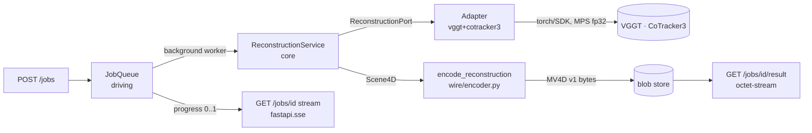

# 06 — Backend Spec

How the build **fills in** the existing `backend/app/**` stubs. This spec does
**not** rearchitect the tree — it finalizes signatures, the port contract, the
adapters, the reconstruction pipeline, the async job model, and the exact FastAPI
surface. The hexagonal boundary (handover §3) is **non-negotiable**.

Authority chain:
- The **MV4D v1 wire bytes** are owned by [05-data-contract.md](05-data-contract.md) — referenced here, **never** redefined.
- The **`Scene4D` domain model** is owned by [05-data-contract.md](05-data-contract.md) §5.1 — reproduced below for convenience; if they disagree, **05 wins**.
- **Versions / repo IDs / licenses / MPS install** are owned by [08-dependencies-and-env.md](08-dependencies-and-env.md) — never invent a version here.
- **Locked decisions** D1–D10 + corrections C1–C7 are owned by [03-decisions-locked.md](03-decisions-locked.md).
- Frontend consumption (decoder, render attrs) is [07-frontend-spec.md](07-frontend-spec.md); tests are spec/10; deploy is spec/11.

---

## 1. Layering map (what is core, what is not)

Files marked `(new)` are created by the build; the rest fill existing stubs.

```
backend/app/
  core/                      ← PURE. No fastapi, no torch, no adapter imports.
    ports/reconstruction_port.py   ReconstructionPort + AdapterInfo + ProgressSink
    domain/models.py               ReconstructionRequest, Scene4D + sub-models
    domain/errors.py        (new)   ReconstructionError hierarchy (§2.2)
    services/reconstruction_service.py  ReconstructionService + smooth/cull/caps helpers (pure numpy; NOT split)
  adapters/                  ← DRIVEN. The ONLY place a model SDK / torch is imported.
    vggt_adapter.py · cotracker3_adapter.py · spatialtracker_adapter.py
    pi3_adapter.py · open_d4rt_adapter.py        (fill stubs)
    combo.py          (new)  VggtCoTracker3Adapter — default "vggt+cotracker3" (§4.6)
    registry.py       (new)  id → factory; build_adapter() (§4.6)
    fixture_adapter.py (new) FixtureAdapter — "fake" no-ML fixture mode (§4.6)
  pipeline/           (new)  ← shared, model-agnostic-ish utils (numpy/opencv; no fastapi)
    decode.py                decode_and_subsample(request) → frames [S,3,H,W] @ width 518
    lift.py                  2D tracks + VGGT depth/intrinsics/pose → 3D Tracks (§5 step 4 formula)
    assemble.py              assemble_scene4d(geo, tr, request) → already-split Scene4D (DOES the static/dynamic split using geo's raw per-frame maps; §4.6/§5)
    quantize.py              AABB + 16-bit quantize helpers (for the encoder)
  wire/encoder.py            encode_reconstruction(scene: Scene4D) -> bytes  (MV4D v1)
  wire/decoder.py     (new)  Python reference decoder — `decode(buffer: bytes) -> Scene4D` (mirrors spec/05 §3): dequantized f32 positions, dynamic_positions as list[ndarray] per frameDir, visibility (M,T) bool unpacked from the LSB-first bitmask, static_conf/colors u8. Used by tests (T-100) + FixtureAdapter.
  jobs/queue.py              JobQueue + in-process background worker  ← DRIVING
  api/routes/jobs.py         FastAPI endpoints                        ← DRIVING
  api/sse.py / api/errors.py / api/deps.py  (new)  SSE helper, error→HTTP map, DI wiring  ← DRIVING
  main.py · config.py        (fill: lifespan adapter wiring; new Settings fields §8)
```
Shared helpers named in §4/§5 (`decode_and_subsample`, the 2D→3D lift,
`assemble_scene4d`/quantize) live in `app/pipeline/*` — kept out of the adapters so
each adapter stays thin. The **model-agnostic** post-processing (`smooth_and_cull`,
`enforce_caps`) lives in `core/services/` (numpy, no torch); the **static/dynamic
split** lives in `pipeline/assemble.py` (adapter-side) because it consumes the raw
per-frame VGGT maps in `GeometryResult`, which never enter `Scene4D` / cross the port.

**The one rule that makes wrong architecture hard to write:** `core/` imports
nothing from `adapters/`, `api/`, `jobs/`, `wire/`, FastAPI, numpy-via-torch, or
torch. It imports `numpy` only (domain arrays). A lint/import test in spec/10
asserts this. Adapters return **numpy / Python types only** — no torch tensor
crosses the port boundary.



---

## 2. `ReconstructionPort` — full contract

Replaces the scaffold in `core/ports/reconstruction_port.py`. The stub had a
single `reconstruct(request) -> ReconstructionResult`; the finalized port adds a
**progress sink**, a **capabilities/`info()`** descriptor, and a **typed error
hierarchy**.

```python
# core/ports/reconstruction_port.py
from __future__ import annotations
from abc import ABC, abstractmethod
from dataclasses import dataclass
from typing import Protocol

from app.core.domain.models import ReconstructionRequest, Scene4D


class ProgressSink(Protocol):
    """Adapters report fractional progress; the worker forwards it to /jobs/{id}.
    Pure callable — no FastAPI/queue type leaks into core."""
    def __call__(self, progress: float, stage: str) -> None: ...
    # progress in [0,1]; stage is a short label e.g. "vggt", "tracking", "encode".


@dataclass(frozen=True)
class AdapterInfo:
    """Static capability + provenance descriptor. Surfaced in job metadata so the
    API can label the active model's weight license (D2) and gate by capability."""
    name: str                 # stable id, e.g. "vggt+cotracker3"
    produces_tracks: bool     # emits Tracks (the ribbons)?
    dynamic: bool             # emits per-frame dynamic foreground points?
    mps_capable: bool         # runs on the 36GB Apple-Silicon Mac via MPS (fp32)?
    weights_license: str      # SPDX-ish tag, e.g. "cc-by-nc-4.0" (D2 / spec/08 §7)
    default_weights: str      # HF repo id, e.g. "facebook/VGGT-1B"


class ReconstructionPort(ABC):
    """Implemented by every model adapter (app/adapters/*)."""

    name: str  # short, stable id; mirrors AdapterInfo.name

    @property
    @abstractmethod
    def info(self) -> AdapterInfo:
        """Capabilities + license. MUST be cheap (no model load)."""

    @abstractmethod
    def reconstruct(
        self,
        request: ReconstructionRequest,
        progress: ProgressSink | None = None,
    ) -> Scene4D:
        """Run feedforward 4D reconstruction on a short, already-capped clip.

        MUST NOT assume CUDA; the MPS/CPU path must work for short clips on
        Apple Silicon. Output is in mayavius world space (spec/05 §2): right-handed,
        +X right / +Y up / -Z forward — the ADAPTER transforms native output into
        this convention before returning. Raises ReconstructionError subclasses
        (§2.2). Reports progress via `progress` if given."""
```

> **Stub change.** `reconstruct` now returns `Scene4D` (not the placeholder
> `ReconstructionResult`) and takes an optional `progress` sink. The five adapter
> files update their signatures accordingly (§4). `name` stays a class attr;
> `info` is a new abstract property.

### 2.1 Why a `ProgressSink` Protocol (not a queue handle)

The core must not import `jobs/`. A `Protocol`-typed callable lets the worker pass
a closure that writes into the `JobQueue`, while the adapter only sees
`progress(0.4, "tracking")`. Keeps the streaming feature (handover §4.4) on the
driving side. If `progress is None`, adapters skip reporting (used by unit tests).

### 2.2 Typed error contract → HTTP mapping

All adapter/pipeline failures raise a `ReconstructionError` subclass. `core` defines
them (no FastAPI import); `api/routes/jobs.py` owns the **single** mapping table.

```python
# core/domain/errors.py   (core may define errors; it must not map them to HTTP)
class ReconstructionError(Exception):
    """Base. Carries a human message + a stable `code` for the API."""
    code: str = "reconstruction_error"

class UnsupportedDeviceError(ReconstructionError):     # e.g. CUDA-only adapter on MPS
    code = "unsupported_device"
class ClipTooLongError(ReconstructionError):           # frames/duration exceed caps
    code = "clip_too_long"
class UnsupportedMediaError(ReconstructionError):       # undecodable / not a video
    code = "unsupported_media"
class ModelLoadError(ReconstructionError):             # weights download/init failed
    code = "model_load_failed"
class InferenceError(ReconstructionError):             # runtime failure (e.g. MPS op gap)
    code = "inference_failed"
class EmptyReconstructionError(ReconstructionError):   # produced 0 usable points
    code = "empty_reconstruction"
```

| Exception | HTTP (on submit, sync validation) | Job terminal status (async) | Notes |
|-----------|-----------------------------------|------------------------------|-------|
| `UnsupportedMediaError` | **415** Unsupported Media Type | `failed` + `code` | bad/unreadable upload |
| `ClipTooLongError` | **413** Payload Too Large | `failed` + `code` | over frame/duration cap; we subsample first, so this is rare |
| `UnsupportedDeviceError` | **501** Not Implemented | `failed` + `code` | e.g. SpatialTrackerV2/Pi3 asked to run on MPS |
| `ModelLoadError` | — (async only) | `failed` + `code` | weights pull failed; surfaced in job error |
| `InferenceError` | — (async only) | `failed` + `code` | MPS op gap / OOM mid-run |
| `EmptyReconstructionError` | — (async only) | `failed` + `code` | culling removed everything |
| Upload byte-size guard (not an adapter error) | **413** | n/a (rejected before enqueue) | `MAX_UPLOAD_MB`, §8 |
| Unknown adapter id in config | **500** at startup | n/a | fail fast, not at request time |

Async failures don't change the HTTP status of `GET /jobs/{id}` (still `200` with
`status:"failed"`, `error:{code,message}`); only the **synchronous** validation
at `POST /jobs` returns the 4xx/5xx above. Mapping lives in one helper
`api/errors.py: http_status_for(err)`.

---

## 3. Domain models (`core/domain/models.py`)

The placeholder `ReconstructionResult(frame_count:int)` is **replaced** by
`Scene4D` (+ `CameraTrack`, `Tracks`) exactly as defined in
[05-data-contract.md](05-data-contract.md) §5.1 — reproduced here so the build has
one place to copy from, but **05 is authoritative for fields/dtypes**:

```python
# core/domain/models.py — replaces ReconstructionResult. NumPy only; no torch.
from dataclasses import dataclass
import numpy as np

@dataclass
class CameraTrack:
    poses: np.ndarray        # (T,7) f32  quaternion(xyzw)+translation, cam->world
    intrinsics: np.ndarray   # (T,4) f32  normalized fx,fy,cx,cy

@dataclass
class Tracks:
    positions: np.ndarray    # (M,T,3) f32  world space
    visibility: np.ndarray   # (M,T)   bool
    colors: np.ndarray | None  # (M,3) u8, optional

@dataclass
class Scene4D:
    frame_count: int                     # T
    fps: float
    aabb_min: np.ndarray                 # (3,) f32
    aabb_max: np.ndarray                 # (3,) f32
    static_positions: np.ndarray         # (N_s,3) f32
    static_colors: np.ndarray            # (N_s,3) u8
    static_conf: np.ndarray | None       # (N_s,) u8, optional
    dynamic_positions: list[np.ndarray]  # len T, each (N_d_t,3) f32
    dynamic_colors: list[np.ndarray]     # len T, each (N_d_t,3) u8
    tracks: Tracks | None
    cameras: CameraTrack | None
    adapter_id: str = ""                 # provenance (NOT serialized into MV4D)
    weights_license: str = ""            # provenance -> job metadata (D2)
```

`ReconstructionRequest` is expanded from the 2-field stub:

```python
@dataclass(frozen=True)
class ReconstructionRequest:
    video_path: str           # local path to the uploaded clip (worker-resolved)
    max_frames: int = 24      # post-subsample cap; MUST be <= 64 (MV4D T<=64, spec/05 §4)
    target_fps: float = 12.0  # subsample target; playback fps written to MV4D header
    device: str = "mps"       # "mps" | "cpu" | "cuda"; default from MAYAVIUS_DEVICE

    def validate(self) -> None:                       # called by the service (§5)
        if not (1 <= self.max_frames <= 64):
            raise ClipTooLongError(f"max_frames must be 1..64, got {self.max_frames}")
        if self.target_fps <= 0:
            raise ValueError("target_fps must be > 0")
```

**One mechanism, no mutation.** Validation is a `validate()` method the service
calls (there is no `__post_init__` fork). The instance is `frozen=True`, so it is
never mutated — the **clamp happens at the construction site**: the POST handler
builds the request with `max_frames=min(settings.max_clip_frames, 64)` (§7), so an
over-cap config can never produce `max_frames > 64`. `validate()` then asserts the
invariant (and `target_fps > 0`); it raises rather than clamps, but in practice the
construction-site clamp means `ClipTooLongError` only fires on a programmer error.

---

## 4. Adapters

One file per model under `app/adapters/`. **Every model SDK / torch import lives
inside the adapter module** (lazily, inside `reconstruct`/`_load`, so importing the
adapter for its `info` never imports torch — keeps `info` cheap and lets the API
advertise capabilities without ML deps installed). Each adapter:
1. transforms native output → mayavius world space (spec/05 §2) **before** returning;
2. forces **fp32** on MPS (C3: not because MPS lacks fp16, but because these ports do);
3. sets `PYTORCH_ENABLE_MPS_FALLBACK=1` **before** importing torch (spec/08 §5);
4. license-tags itself via `AdapterInfo.weights_license` (D2).

### 4.1 `VggtAdapter` (static reconstructor — default)

| Aspect | Value (source: spec/08 §4.3, decision-log §D/E) |
|--------|--------------------------------------------------|
| Source | `from vggt.models.vggt import VGGT`; `VGGT.from_pretrained("facebook/VGGT-1B")` |
| Input | a **set of frames** `[S,3,H,W]`, RGB, **width rescaled to 518 px** (not a video file) |
| Device | `device="mps"`, **fp32**, **no** `torch.cuda.amp.autocast` (community-port pattern, `jmanhype/vggt-mps`, MIT, reference only) |
| Outputs used | **per-frame** world point maps `(S,H,W,3)`(+conf) → static/dynamic split (§5 step 5); **per-frame** depth `(S,H,W)`(+conf) + **per-frame** camera (extrinsics+intrinsics) → the 2D→3D lift + the CAMERAS section. VGGT runs **once** on all `S` frames. |
| `AdapterInfo` | `name="vggt"`, `produces_tracks=False`, `dynamic=False`, `mps_capable=True`, `weights_license="cc-by-nc-4.0"`, `default_weights="facebook/VGGT-1B"` |

Negative knowledge encoded: VGGT has a **2D track head** for *static* scenes but
**no native dynamic 3D tracks** (C1) — so the dynamic layer comes from CoTracker3,
not VGGT. Commercial static-only swap = `facebook/VGGT-1B-Commercial` (AUP, gated)
via `MAYAVIUS_VGGT_WEIGHTS`; default stays NC to avoid gating local dev (spec/08 §4.3).

```python
# adapters/vggt_adapter.py (illustrative reconstruct skeleton)
class VggtAdapter(ReconstructionPort):
    name = "vggt"
    @property
    def info(self) -> AdapterInfo:
        return AdapterInfo("vggt", produces_tracks=False, dynamic=False,
                           mps_capable=True, weights_license="cc-by-nc-4.0",
                           default_weights="facebook/VGGT-1B")
    def reconstruct(self, request, progress=None) -> Scene4D:
        import os; os.environ.setdefault("PYTORCH_ENABLE_MPS_FALLBACK", "1")
        import torch  # noqa: imported here, never in core
        frames = decode_and_subsample(request)          # numpy uint8 [S,3,H,W] @ width 518, RGB (§5; torch-free)
        t = torch.from_numpy(frames).to(request.device).float() / 255.0   # adapter converts numpy→torch
        with torch.no_grad():                           # fp32; NO autocast on MPS
            preds = self._model(t)
        # preds.world_points(+conf), preds.depth(+conf), preds.extrinsics/intrinsics
        # -> transform to mayavius world space, build static_* + cameras
        ...
```

> The default combo (§4.6) reuses this adapter's `preds.depth` + camera for the
> CoTracker3 3D lift, so the VGGT forward pass runs **once** and feeds both layers.

#### 4.1a VGGT native output → mayavius world space (the coordinate contract)

spec/05 §2 pins only the TARGET convention (mayavius: right-handed, +X right /
+Y up / −Z forward; camera→world; xyzw quaternion). VGGT's native output differs and
the adapter MUST transform it — T-310 / DoD §2.6 assert "a known point lands in
mayavius world space", so this is a correctness contract, not a detail.

VGGT-1B native (confirm exact symbol names against the installed `vggt` package at
W3; structure per decision-log §D + the VGGT README):
- Camera pose is a packed **pose encoding**, decoded with
  `from vggt.utils.pose_enc import pose_encoding_to_extri_intri` →
  **extrinsics = world→camera** `(S,3,4)` and **intrinsics in pixels** `(S,3,3)`.
- **Convention = OpenCV camera**: +X right, **+Y down**, **+Z forward** (into scene).
- `depth (S,H,W)` = z-along-optical-axis (not ray length); `world_points (S,H,W,3)`
  already in VGGT's world frame.

Deterministic transform the adapter applies to **every** world position
(`world_points`, depth-lifted track points) and camera (apply identically so points
and cameras stay consistent):
1. camera→world: `c2w = inv(w2c)` (invert the extrinsic).
2. OpenCV→mayavius axis flip (`F = diag(1,−1,−1)`, `F = F⁻¹`): for every world point
   and every camera translation `p_may = F·p = (x, −y, −z)`; the camera-to-world
   **rotation** transforms as the **similarity** `R_may = F · R_c2w · F` (a
   left-multiply-only `F·R` is **wrong** — it does not flip the camera's own basis).
   Then `t_may = F · t_c2w`.
3. rotation → **xyzw** unit quaternion (mayavius / Three.js order) for CAMERAS.
4. intrinsics → **normalized** `(fx/W, fy/H, cx/W, cy/H)` for the MV4D CAMERAS
   section (spec/05 §3.7).

If empirical W3 validation (T-510) shows VGGT-1B emits a different handedness,
correct the flip there and log it — but the **target** (mayavius §2) is fixed.

### 4.2 `CoTracker3Adapter` (2D tracker → 3D via VGGT depth — default dynamic layer)

| Aspect | Value (source: spec/08 §4.4, decision-log §D) |
|--------|------------------------------------------------|
| Source | `torch.hub.load("facebookresearch/co-tracker", "cotracker3_offline")` (offline = whole short clip at once; `cotracker3_online` available for streaming) |
| Device | **first-class MPS** — CoTracker auto-selects `cuda > mps > cpu` (merged upstream PR #14) |
| Output | `pred_tracks (B,T,N,2)` + `pred_visibility (B,T,N,1)` |
| Lift to 3D | `pred_tracks (u,v)` are **pixels in the 518-width frame**; unproject with VGGT per-frame depth + **pixel** intrinsics, then axis-flip + cam→world (§5 step 4 formula / §4.1a transform) → `Tracks.positions (M,T,3)`; `pred_visibility` → `Tracks.visibility (M,T)`; sample frame-0 color → `Tracks.colors (M,3)` |
| `AdapterInfo` | `name="cotracker3"`, `produces_tracks=True`, `dynamic=True`, `mps_capable=True`, `weights_license="cc-by-nc-4.0"`, `default_weights="facebook/cotracker3"` |

`CoTracker3Adapter` alone returns a `Scene4D` with `tracks` populated and empty
static/dynamic — it depends on a depth+intrinsics source for the lift. In the
default combo it receives VGGT's depth/camera (passed via the composing adapter,
§4.6), so it does **not** re-run a reconstructor. Query-point seeding default =
a regular grid (e.g. 32×32) over frame 0, capped to `M ≤ 4096` (spec/05 §4); a
foreground-mask seeding alternative is documented in §5 risk #3.

### 4.3 `SpatialTrackerV2Adapter` (optional — single-model dynamic; **CUDA-only**)

The single-model route: dynamic 3D tracks **and** geometry in one pass — attractive
because it avoids the VGGT+lift dance. **Negative knowledge (decision-log §D, spec/08 §4.5):**

- Repo slug is `henry123-boy/SpaTrackerV2` (casing); weights `Yuxihenry/SpatialTrackerV2_Front`/`-Online`/`-Offline`.
- **CUDA-only:** upstream pins `torch==2.4.1+cu124`. **Not Mac-installable as-is.**
- Code license is **CC-BY-NC-4.0** (GitHub shows `NOASSERTION` — a CC-detection gap, **not** permissive).

`info.mps_capable=False`. On `device in {"mps","cpu"}` the adapter raises
`UnsupportedDeviceError("SpatialTrackerV2 is CUDA-only; use the cloud-GPU deploy (spec/11)")`
— it does **not** silently fall back. It is **not** added to the local ML install
(spec/08 §4.5); it is a cloud/optional adapter (`MAYAVIUS_DEVICE=cuda` on the HF Space, D9).

```python
@property
def info(self):  # spatialtracker_v2
    return AdapterInfo("spatialtracker_v2", produces_tracks=True, dynamic=True,
                       mps_capable=False, weights_license="cc-by-nc-4.0",
                       default_weights="Yuxihenry/SpatialTrackerV2_Offline")
```

### 4.4 `Pi3Adapter` (optional — **no MPS**)

Fast feedforward static point cloud + camera, like VGGT. **Negative knowledge
(spec/08 §4.6, decision-log §D):**

- **No official MPS path** — PR #153 open/unmerged; `demo_gradio.py` hard-fails without CUDA.
- License: **code BSD-3-Clause** (commercial OK, C2) but **weights CC-BY-NC-4.0** (HF tags `bsd-2-clause` inconsistently → treat as NC).

`info.mps_capable=False`; raises `UnsupportedDeviceError` on MPS. Kept as a
CUDA/deploy-path swap-in for the static layer (alternative to VGGT) — **not** the
Mac default (handover §3 / hard constraint).

### 4.5 `OpenD4RTAdapter` (optional — the unofficial open D4RT; GPU)

The concrete drop-in for the "swap in the real thing later" story (handover §2/§8,
C5). Official Google DeepMind D4RT (arXiv:2512.08924) is **still unreleased**
(decision-log §F); the wrapped candidate is the **unofficial** reimpl:

- Repo `Lijiaxin0111/Open-d4rt` (**Apache-2.0**); weights `Lijiaxin0111/OpenD4RT`.
- GPU/PyTorch-oriented; **MPS unverified** → `info.mps_capable=False` until measured on the Mac (spec/10). Do not assume it runs on MPS.

`weights_license="apache-2.0"` (the cleanest license in the set). Because it is a
unified static+dynamic decoder, when it matures it can replace the entire
VGGT+CoTracker3 combo behind the same port — **no core change** (the architectural payoff).

### 4.5a Adapter intermediate structs (combo-internal; NOT core domain)

The combo (§4.6) passes two intermediate results between its sub-adapters and the
assembler. These are **adapter/pipeline-side** dataclasses (they carry model-shaped
arrays, so they live with `app/pipeline`/adapters, not in `core/domain`), numpy only:

```python
# app/pipeline/assemble.py (or a shared adapters types module)
from dataclasses import dataclass
import numpy as np
from app.core.domain.models import CameraTrack   # adapters/pipeline MAY import core domain

@dataclass
class GeometryResult:            # VggtAdapter.run_geometry → this
    world_points: np.ndarray     # (S,H,W,3) f32, ALREADY in mayavius world space (§4.1a)
    world_points_conf: np.ndarray  # (S,H,W) f32
    depth: np.ndarray            # (S,H,W) f32, z-along-axis
    depth_conf: np.ndarray       # (S,H,W) f32
    camera: CameraTrack          # (T==S) per-frame pose+intrinsics, mayavius convention

@dataclass
class TrackResult:               # CoTracker3Adapter.run_tracks (after the §5 step 4 lift) → this
    positions: np.ndarray        # (M,T,3) f32 world space
    visibility: np.ndarray       # (M,T) bool
    colors: np.ndarray           # (M,3) u8
```
`run_geometry` / `run_tracks` are thin methods on `VggtAdapter` / `CoTracker3Adapter`
returning these, so the combo runs VGGT once and feeds `geo.depth`/`geo.camera` to
the lift.

### 4.6 Default combo: `"vggt+cotracker3"` (the `MAYAVIUS_ADAPTER` default)

The default `MAYAVIUS_ADAPTER=vggt+cotracker3` (spec/08 §6) is **not** a sixth model
file — it is a small **composing adapter** that implements `ReconstructionPort` by
orchestrating `VggtAdapter` (static + depth/camera) and `CoTracker3Adapter` (tracks),
running VGGT **once** and feeding its depth/intrinsics/pose to the lift:

```python
# adapters/combo.py  (registered under id "vggt+cotracker3")
class VggtCoTracker3Adapter(ReconstructionPort):
    name = "vggt+cotracker3"
    @property
    def info(self):
        return AdapterInfo("vggt+cotracker3", produces_tracks=True, dynamic=True,
                           mps_capable=True, weights_license="cc-by-nc-4.0",
                           default_weights="facebook/VGGT-1B + facebook/cotracker3")
    def reconstruct(self, request, progress=None) -> Scene4D:
        frames = decode_and_subsample(request)                 # shared util (§5)
        progress and progress(0.10, "decode")
        geo = self._vggt.run_geometry(frames, request)         # -> GeometryResult (§4.5a)
        progress and progress(0.55, "vggt")
        tr  = self._cot.run_tracks(frames, depth=geo.depth, cam=geo.camera)  # -> TrackResult (lift §5 step 4)
        progress and progress(0.80, "tracking")
        scene = assemble_scene4d(geo, tr, request)             # RAW Scene4D only (pipeline/assemble.py)
        progress and progress(0.95, "assembled")
        return scene                                            # split/smooth/cull happen in the SERVICE (§5)
```

**Ownership (split is adapter-side; the core stays model-agnostic):**
`assemble_scene4d` (`pipeline/assemble.py`) does the **static/dynamic split** and
returns an **already-split** `Scene4D`. It consumes `geo`'s **raw per-frame world
point maps** `(S,H,W,3)` — which therefore **never enter `Scene4D` and never cross
the port** — classifies each frame-`t` point moving/static (§5 step 5), and fills
`static_positions` (deduped low-motion union), `dynamic_positions[t]`
(+`dynamic_colors[t]`, the dense moving subset), `tracks` (from `tr`), `cameras`
(from `geo.camera`), and the AABB over all. The **core `ReconstructionService.run`**
then does **only** model-agnostic post-processing on that canonical `Scene4D` —
`smooth_and_cull` + `enforce_caps` (§5 steps 6-7), using `Scene4D` fields only. So the
adapter owns the model-shaped work (coordinate transform §4.1a + the split using raw
maps); the pure core owns smoothing/culling/caps (T-310's "honors caps" is the
service's job). The split runs **once**, in `assemble` — no double-apply.

A tiny **registry** maps id → factory so the API/worker resolve the adapter from
config without `core` knowing concrete classes:

```python
# adapters/registry.py
_FACTORIES = {
    "vggt+cotracker3": lambda s: VggtCoTracker3Adapter(s),  # default (D1)
    "vggt":            lambda s: VggtAdapter(s),            # static only
    "cotracker3":      lambda s: CoTracker3Adapter(s),      # tracks only (needs depth source)
    "spatialtracker_v2": lambda s: SpatialTrackerV2Adapter(s),  # cloud/CUDA
    "pi3":             lambda s: Pi3Adapter(s),             # cloud/CUDA
    "open_d4rt":       lambda s: OpenD4RTAdapter(s),        # optional GPU
    "fake":            lambda s: FixtureAdapter(s),         # fixture mode — NO ML (Waves 1–2 + e2e)
}
def build_adapter(settings) -> ReconstructionPort:
    try: return _FACTORIES[settings.adapter](settings)
    except KeyError: raise RuntimeError(f"unknown MAYAVIUS_ADAPTER={settings.adapter!r}")
```

`build_adapter` is called **once at startup** (FastAPI lifespan) and the instance
is injected into `ReconstructionService`. Unknown id → fail fast (500 at startup,
§2.2 table).

**`FixtureAdapter` (`app/adapters/fixture_adapter.py`) — the no-ML fixture mode.**
Waves 1–2 and all Playwright e2e (spec/09, spec/10 §4) run with
`MAYAVIUS_ADAPTER=fake`, which resolves to a **production** (non-test) adapter that
imports **no torch** and returns a deterministic `Scene4D` — it loads a committed
example MV4D blob (the golden/example fixture, spec/10 §2/§6) and decodes it back to
`Scene4D` via `app/wire/decoder.py`, or builds a small hand-authored `Scene4D`. This
is distinct from the unit-test `FakeAdapter` (`backend/tests/fakes/`, spec/10 §1.2):
`FakeAdapter` is test-only; `FixtureAdapter` is importable in production so the full
API + viewer are exercisable with zero ML deps. `info` = `AdapterInfo("fake",
produces_tracks=True, dynamic=True, mps_capable=True, weights_license="none",
default_weights="(fixture)")`. It runs the §5 post-processing path normally so the
job lifecycle, SSE, and `/result` are real — only the model is faked. **It MUST emit
`progress(0.25, "decode")` then `progress(0.75, "assemble")` before returning** so the
job deterministically passes through a non-terminal `running` state with monotonic
progress (T-303), even though the work is near-instant.

### 4.7 Adapter capability matrix

| Adapter id | tracks | dynamic | MPS (Mac) | weights license | role |
|------------|:------:|:-------:|:---------:|-----------------|------|
| `vggt+cotracker3` **(default)** | ✅ | ✅ | ✅ fp32 | cc-by-nc-4.0 | MVP combo (D1) |
| `vggt` | ❌ | ❌ | ✅ fp32 | cc-by-nc-4.0 | static layer; commercial swap `VGGT-1B-Commercial` (gated) |
| `cotracker3` | ✅ | ✅ | ✅ | cc-by-nc-4.0 | tracks (needs depth source) |
| `spatialtracker_v2` | ✅ | ✅ | 🚫 CUDA-only | cc-by-nc-4.0 | cloud/optional (spec/11) |
| `pi3` | ❌ | ❌ | 🚫 no MPS | code BSD-3 / weights NC | cloud/optional static |
| `open_d4rt` | ✅ | ✅ | ⚠️ unverified | apache-2.0 | future unified drop-in |
| `fake` (fixture) | ✅ | ✅ | ✅ (no ML) | none | fixture mode (Waves 1–2 + e2e); deterministic `Scene4D` from a committed blob, **no torch** |

---

