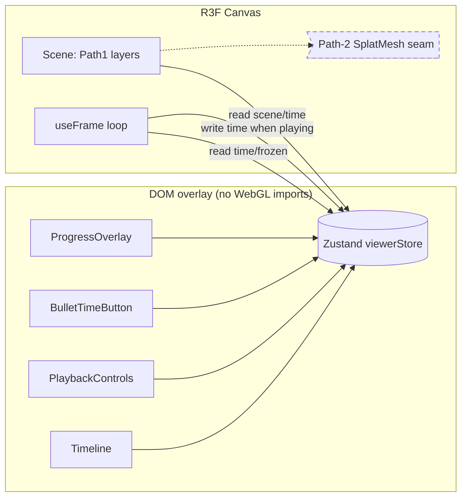

# 07 — Frontend Spec (Next.js 16 + react-three-fiber, Path 1)

The browser half of mayavius: a **static, SEO-indexable landing** that uploads a
clip and a **client-only WebGL viewer** that plays back the decoded **MV4D v1**
scene as an animated colored point cloud + 3D track ribbons (Path 1). This file
specifies the component tree, the Three.js scene graph, decoder→GPU integration,
the Zustand store extension, playback + bullet-time, the upload→poll→reveal UX,
and the SEO surface. It **fills in the existing `frontend/src/**` stubs — it does
not rearchitect them.**

Authorities this file defers to (it references, never redefines):
- Wire format / decoded types: [05-data-contract.md](05-data-contract.md) — the
  byte layout and `Mv4dScene` shape are **its** authority; this file only states
  how those bytes become Three.js attributes.
- Backend API (endpoints, job lifecycle, SSE, error contract):
  [06-backend-spec.md](06-backend-spec.md).
- Architecture / hexagonal seam, Path 1 vs Path 2: [04-architecture.md](04-architecture.md).
- Locked decisions D1–D10 + corrections C1–C7: [03-decisions-locked.md](03-decisions-locked.md).
- Pins, repo IDs, licenses: [08-dependencies-and-env.md](08-dependencies-and-env.md).

> **Next.js 16 caveat (frontend/AGENTS.md):** App Router APIs differ from older
> training data. `params`/`searchParams` are **async (Promises) — always
> `await`**. `dynamic(..., { ssr: false })` is **forbidden in Server
> Components** and MUST live in a Client Component. Consult
> `frontend/node_modules/next/dist/docs/01-app/` before changing routing.

---

## 1. Component tree

```
app/layout.tsx                 Server · site-wide <html>/<body> + metadataBase + OG defaults  [EXISTS]
├─ app/page.tsx                Server · static landing (indexable). ADD UploadDropzone + ExampleGallery
│   ├─ <Hero/>                 Server · headline/tagline copy (config.ts)
│   ├─ <UploadDropzone/>       Client · drag/drop or pick → submitClip() → /view/[jobId]      [ADD]
│   └─ <ExampleGallery/>       Server shell + Client cards · preloaded CC clips (D10)          [ADD]
├─ app/view/[id]/page.tsx      Server · async params + generateMetadata (share card)          [EXISTS]
│   └─ <ViewerClient resultId/>  Client · the ssr:false boundary                              [EXISTS]
│       └─ dynamic(()=>import('./ViewerCanvas'),{ssr:false})
│           └─ <ViewerCanvas/>   Client · R3F <Canvas> + <OrbitControls/>                     [EXISTS→fill]
│               ├─ <Scene/>      Client · Path-1 layers (the Scene.tsx seam)                  [EXISTS→fill]
│               │   ├─ <PointCloud layer="static"/>   THREE.Points + dequant ShaderMaterial   [ADD]
│               │   ├─ <PointCloud layer="dynamic"/>  per-frame foreground                     [ADD]
│               │   └─ <TrackRibbons/>                Line2/LineSegments2                       [ADD]
│               └─ <ViewerOverlay/>  Client · DOM HUD over the canvas (NOT in WebGL)            [ADD]
│                   ├─ <Timeline/>          scrubber (time 0..1)                                [ADD]
│                   ├─ <PlaybackControls/>  play/pause + loop toggle                            [ADD]
│                   ├─ <BulletTimeButton/>  freeze + free-orbit toggle                          [ADD]
│                   └─ <ProgressOverlay/>   job status + 0..1 progress + license label          [ADD]
├─ app/sitemap.ts              Server · indexed routes only (landing)                          [EXISTS]
└─ app/robots.ts               Server · /robots.txt                                            [EXISTS]
```

Existing scaffold files (verified on disk) — what each becomes:

| File | Now (scaffold) | This spec fills in |
|------|----------------|--------------------|
| `app/layout.tsx` | OG/twitter defaults, `metadataBase` | keep; no change |
| `app/page.tsx` | placeholder hero + "Open the viewer" link | real `<Hero>` + `<UploadDropzone>` + `<ExampleGallery>` |
| `app/view/[id]/page.tsx` | async `params`, `generateMetadata`, mounts `ViewerClient` | enrich `generateMetadata` (§8); page stays server |
| `components/viewer/ViewerClient.tsx` | `dynamic(ssr:false)` wrapper | keep as the boundary; no change |
| `components/viewer/ViewerCanvas.tsx` | `<Canvas>` + `<OrbitControls makeDefault>` + placeholder badge | host `<Scene>` + `<ViewerOverlay>`, wire camera mode (§5) |
| `components/viewer/Scene.tsx` | placeholder icosahedron | `<PointCloud>` ×2 + `<TrackRibbons>` + **Path-2 seam comment kept** (§7) |
| `lib/state/viewerStore.ts` | `time/isPlaying/loop/frozen` | EXTEND: `scene/loadState/cameraMode` (§4) |
| `lib/wire/decoder.ts` | throws NotImplemented | implement per [05](05-data-contract.md) → `Mv4dScene` |
| `lib/api/client.ts` | throws NotImplemented | implement `submitClip/getJobStatus/streamJob/fetchResult` per [06](06-backend-spec.md) |
| `types/index.ts` | placeholder `ReconstructionResult` | replaced by `Mv4dScene` (defined in [05 §5.2](05-data-contract.md)) |
| `config.ts` | `SITE_URL/API_BASE_URL/SITE_NAME/SITE_TAGLINE` | add viewer tunables (§4.3) — keep env-driven |

**Rule (render path decoupling — spec/03 Part 1 §2; handover §4.2):** all UI (`ViewerOverlay`
and children) is **plain DOM** positioned over the canvas and talks to the
viewer **only through the Zustand store**. It NEVER imports Three.js or Path-1
components. This is what lets a Path-2 `<SplatMesh>` mount at the `Scene.tsx`
seam without touching a single control (§7).



---

## 2. Three.js scene graph (Path 1)

Path 1 is **locked** (D1, handover §4.1): `THREE.Points` with a **custom
`ShaderMaterial`** + `Line2`/`LineSegments2` track ribbons. No new runtime deps —
the line classes ship inside `three` (`three/addons/lines/…`), per
[08 §2](08-dependencies-and-env.md). Spark is NOT imported.

### 2.1 `<PointCloud>` (THREE.Points + dequant shader)

One component, two instances: **static** (built once, rendered every frame) and
**dynamic** (foreground, geometry swapped per frame `t`). Both consume the
**quantized `Uint16` positions** from MV4D and **dequantize on the GPU** — the
load-time win in [05 §1](05-data-contract.md) depends on never copying/expanding
positions to `Float32` on the CPU.

Geometry attributes (built directly over decoder views, zero-copy):

| Attribute | Source ([05 §5.2](05-data-contract.md)) | Three.js setup |
|-----------|------------------------------------------|----------------|
| `position` | `positionsQ : Uint16Array` (len `count*3`) | `new THREE.BufferAttribute(positionsQ, 3, /*normalized*/ true)` → shader reads `[0,1]`, value `q/65535` |
| `color` | `colors : Uint8Array` (len `count*3`) | `new THREE.BufferAttribute(colors, 3, true)` → `[0,1]` sRGB |

> **Why `normalized:true`:** WebGL feeds normalized integer attributes to the
> vertex shader as floats in `[0,1]` (i.e. `q/65535`, `byte/255`). The shader
> then dequantizes positions to world space with `aabbMin/aabbMax`. CPU touches
> nothing.

Uniforms: `uAabbMin`, `uAabbMax` (`vec3`, from `Mv4dScene.aabbMin/aabbMax`),
`uPointSize` (base px), `uViewportHeight` (for perspective sizing), `uOpacity`.

Vertex shader (illustrative; **dequant + depth-based sizing**):
```glsl
uniform vec3 uAabbMin, uAabbMax;
uniform float uPointSize, uViewportHeight;
varying vec3 vColor;
void main() {
  vColor = color;                                  // attribute (sRGB, see frag)
  vec3 world = uAabbMin + position * (uAabbMax - uAabbMin); // position = q/65535
  vec4 mv = modelViewMatrix * vec4(world, 1.0);
  gl_Position = projectionMatrix * mv;
  // perspective point sizing: nearer points larger, clamped (risk #4 — aesthetics)
  gl_PointSize = clamp(uPointSize * (uViewportHeight / -mv.z), 1.0, 12.0);
}
```
Fragment shader (round sprite + sRGB→linear so colors aren’t washed out — risk #4):
```glsl
varying vec3 vColor;
uniform float uOpacity;
void main() {
  vec2 d = gl_PointCoord - 0.5;
  if (dot(d, d) > 0.25) discard;                   // circular point
  vec3 lin = pow(vColor, vec3(2.2));               // treat attribute as sRGB
  gl_FragColor = vec4(lin, uOpacity);
}
```
> **Point-cloud aesthetics = risk #4.** Levers, all uniform-driven (no
> rebuild): round sprites (`discard`), depth-based `gl_PointSize` (clamped),
> sRGB→linear conversion, and `uOpacity` for the dynamic layer’s motion fade.
> Renderer is configured `THREE.SRGBColorSpace` output; we convert in-shader
> rather than relying on `vertexColors` auto-conversion to keep one code path.

**Static layer:** built once from `scene.static` (≤150k pts, [05 §4](05-data-contract.md));
`frustumCulled = false` (AABB-bounded already); rendered every frame regardless
of `t`.

**Dynamic layer:** `scene.dynamic.frames[t]` selects the active foreground set.
Per-frame point counts vary, so we **pre-allocate one geometry at `max_t
count`** and update `drawRange` + attribute subarray on frame change (avoids
per-frame `BufferGeometry` allocation / GC churn). A frame with `count=0` draws
nothing (valid, [05 §3.5](05-data-contract.md)). Optional trailing-motion fade:
lower `uOpacity` for the dynamic layer; ribbons (§2.2) carry the actual motion
history.

### 2.2 `<TrackRibbons>` (Line2 / LineSegments2)

The `M` tracks (≤4096, [05 §4](05-data-contract.md)) become the **motion
ribbons**: one polyline per track across `T` frames, with **gaps where the
visibility bit is 0**.

| Concern | Decision |
|---------|----------|
| Class | `Line2` + `LineGeometry` + `LineMaterial` (`three/addons/lines/…`) — screen-space width in px, unlike thin `THREE.Line` |
| Positions | `tracks.positionsQ` (`Uint16`, len `M*T*3`) **dequantized to `Float32` on the CPU** — `M*T ≤ 64*4096 ≈ 262k` verts is small; `LineGeometry` needs `Float32`. (Only place we dequant on CPU; static/dynamic stay GPU-dequant.) |
| Gaps (occlusion) | `tracks.isVisible(m,t)` ([05 §5.2](05-data-contract.md)): split track `m` into contiguous **visible runs**; render each run as its own `Line2`. Invisible spans = no segment = ribbon gap |
| Per-track color | `tracks.colors` iff present (`HAS_TRACK_COLOR`); else derive a stable hue from `m` (golden-angle) so ribbons read as distinct trajectories |
| Growth with time | ribbon for track `m` is drawn **only up to the current frame `t`** (`setDrawRange`/per-frame geometry slice) so trails *grow* during playback and the whole ribbon shows when frozen |
| Resolution | `LineMaterial.resolution` set from canvas size on resize (required for px widths) |

> **Negative knowledge:** plain `THREE.Line`/`LineSegments` ignore `linewidth`
> on most platforms — that is why ribbons use `Line2`/`LineSegments2`. If 4096
> separate `Line2` objects ever become a draw-call bottleneck, fall back to a
> single `LineSegments2` with the whole batch and per-vertex alpha=0 across gaps
> (one draw call); switch only if profiling on the 36GB Mac shows it. MVP uses
> per-run `Line2` for simplicity.

---

## 3. Decoder integration (MV4D → BufferAttributes)

The decoder ([05 §5.2](05-data-contract.md), implemented in
`lib/wire/decoder.ts`) returns a `Mv4dScene` of **zero-copy typed-array views
over the fetched `ArrayBuffer`**. This file only specifies the view→attribute
mapping; it does not touch the bytes.

```ts
// lib/viewer/buildScene.ts  (illustrative)
import * as THREE from "three";
import type { Mv4dScene } from "@/types"; // = Mv4dScene from spec/05 §5.2

export function buildStatic(scene: Mv4dScene): THREE.BufferGeometry | null {
  const s = scene.static; if (!s) return null;
  const g = new THREE.BufferGeometry();
  g.setAttribute("position", new THREE.BufferAttribute(s.positionsQ, 3, true)); // u16 normalized
  g.setAttribute("color",    new THREE.BufferAttribute(s.colors,    3, true)); // u8  normalized
  g.boundingBox = new THREE.Box3(
    new THREE.Vector3(...scene.aabbMin), new THREE.Vector3(...scene.aabbMax));
  return g; // dequant happens in the vertex shader (§2.1)
}
```

Rules:
- Static/dynamic positions are **never** expanded to `Float32` on the CPU; only
  `tracks.positionsQ` is (small, §2.2).
- AABB uniforms come from `scene.aabbMin/aabbMax` (one quantization range for all
  sections — [05 §5.1](05-data-contract.md)).
- `time→frame`: `t = Math.round(time * (frameCount - 1))` (matches [05 §2](05-data-contract.md)).
- Decoder throws `Mv4dDecodeError` ([05 §8](05-data-contract.md)); the loader
  catches it, sets `loadState='error'`, surfaces it via `ProgressOverlay`.
- `types/index.ts`’s placeholder `ReconstructionResult` is **deleted** and
  replaced by `Mv4dScene`; update `decoder.ts`, `api/client.ts`, `types/index.ts`
  **together** (one commit, [05 §5.2](05-data-contract.md)).
- The scaffold's `JobStatus` literal **`succeeded`** is renamed to **`done`** —
  the value the backend actually emits ([06 §6](06-backend-spec.md): `DONE="done"`).
  Update `types/index.ts` (`JobStatus = "queued"|"running"|"done"|"failed"`) and
  `api/client.ts` so the poll/SSE loop fires `fetchResult` on `done`. (Leaving
  `succeeded` makes the loop never fire and the viewer hangs.)

---

## 4. Zustand store (`viewerStore`) extension

Extend the existing store ([on-disk](../frontend/src/lib/state/viewerStore.ts):
`time/isPlaying/loop/frozen`) — **do not** rename or remove its fields; the R3F
loop already reads/writes them outside React renders (D6, handover §6).

### 4.1 Added state

| Field | Type | Meaning |
|-------|------|---------|
| `scene` | `Mv4dScene \| null` | decoded result; `null` until loaded |
| `loadState` | `'idle'\|'submitting'\|'processing'\|'loading'\|'ready'\|'error'` | drives `ProgressOverlay`; mirrors job lifecycle ([06](06-backend-spec.md)) + decode |
| `progress` | `number` | 0..1 backend job progress (from poll/SSE) |
| `error` | `string \| null` | user-facing message (decode or job failure) |
| `cameraMode` | `'orbit'\|'asShot'\|'bulletTime'` | §5 |
| `frameCount` | `number` | cached `scene.frameCount` (`T`) so the loop avoids re-reading `scene` each tick |

Kept: `time` (0..1), `isPlaying`, `loop`, `frozen`. `frozen===true` ⇔
`cameraMode==='bulletTime'` (kept consistent by the actions below; `frozen`
retained for back-compat with the scaffold).

### 4.2 Actions (additions)
`setScene(scene)` (sets `scene`+`frameCount`, `loadState='ready'`),
`setLoadState(s)`, `setProgress(p)`, `setError(msg)`, `setCameraMode(mode)`,
`enterBulletTime()` (`pause()`+`setFrozen(true)`+`cameraMode='bulletTime'`),
`exitBulletTime()` (`setFrozen(false)`+`cameraMode='orbit'`). Existing
`setTime/play/pause/toggleLoop/setFrozen` unchanged.

> **Transient-update discipline (D6):** the R3F `useFrame` loop calls
> `setTime(t)` every frame while playing — a deliberately cheap, single-field
> write. UI components subscribe to `time` with a **selector** so the scrubber
> re-renders but the rest of the HUD does not. The loop reads `scene/frozen/loop`
> via `useViewerStore.getState()` (no subscription) to avoid re-render churn.

### 4.3 `config.ts` viewer tunables (added, env-overridable)
`POLL_INTERVAL_MS` (default 800), `USE_SSE` (default `true` — fall back to
polling if the stream errors), `SSE_WATCHDOG_MS` (default **5000** — fall back to
polling if no SSE event arrives within this window; alternative: a few×`POLL_INTERVAL_MS`),
`DEFAULT_FPS_FALLBACK` (24, only if `scene.fps<=0`), `MAX_UPLOAD_MB` (64, mirrors
`MAYAVIUS_MAX_UPLOAD_MB` [08 §6](08-dependencies-and-env.md)), and
**`EXAMPLE_SLUGS`** — `export const EXAMPLE_SLUGS = ['example'] as const` (W4 appends
`'walking-person','street-vehicle','pet-motion','static-scene'`); imported by
`generateMetadata` + `sitemap.ts` for the example/user index split (§8), and MUST
mirror the backend's pinned seed slugs ([06 §6](06-backend-spec.md)).

### 4.4 Test-observability contract (the canonical surface Playwright reads)

The e2e tests need to observe what the WebGL canvas rendered. To avoid the app and
the Playwright suite inventing **incompatible** selectors, there is **one** canonical
surface, always on (a few numbers — negligible cost). `<PlaybackDriver>` writes it
from the R3F `useFrame` loop each frame; spec/10 T-401/T-403/T-405 read exactly these
field names via `page.evaluate(() => window.__mayaviusDebug)`:

```ts
declare global { interface Window { __mayaviusDebug?: MayaviusDebug } }
interface MayaviusDebug {
  staticPointCount: number;   // points in the static layer (0 until a scene loads)
  dynamicPointCount: number;  // points in the current dynamic frame t
  frameIndex: number;         // current t = round(time*(frameCount-1))
  cameraQuaternion: [number, number, number, number];  // camera world quaternion x,y,z,w
}
```
- **T-401** asserts `staticPointCount > 0` once a scene is loaded (cloud present).
- **T-403** asserts `frameIndex` changes when the timeline is scrubbed.
- **T-405** asserts `cameraQuaternion` changes while `frameIndex` stays constant
  (bullet-time: orbit moves the camera, time is frozen).

This is the **only** debug surface (no ad-hoc `data-testid`s for these values). It is
always-on with no build flag, so the e2e build and the shipped build expose the same
contract.

---

